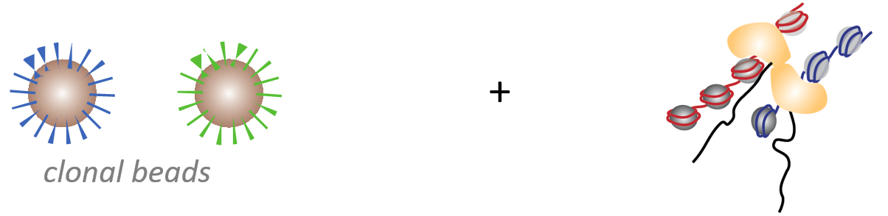
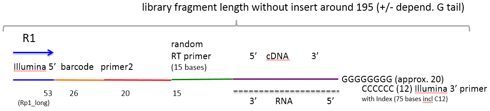
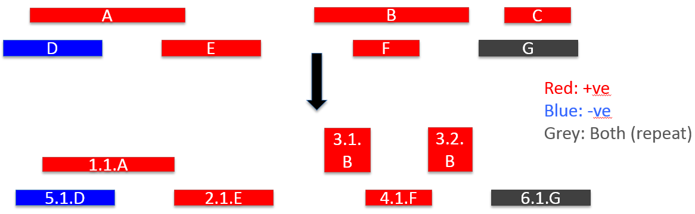
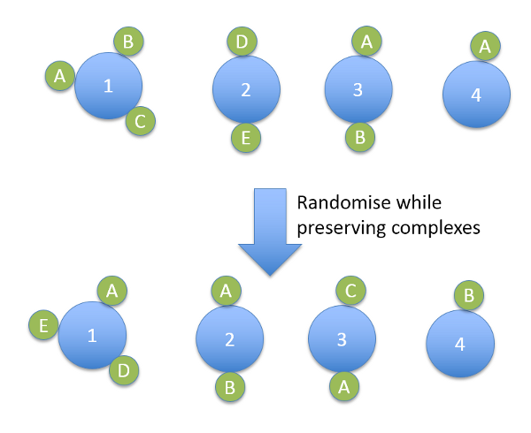

#Don't Panic: CloseCall#

CloseCall is a bioinformatics pipeline for identifying RNA-RNA interactions in NGS datasets generated using a new high-throughput protocol to fix and sequence RNA complexes. The CloseCall pipeline has 3 main components:

1.  Mapping and QC
2.  Monte Carlo Simulation to identify statistically significant RNA-RNA interactions
3.  Chromosome and whole genome structural modelling

##Experimental Procedure##

The method to measure RNA-RNA proximity relies on the tagging of the set of RNA molecules contained in an individual chromatin complex with a unique DNA barcode. To tag many chromatin complexes in a highly parallel fashion, we apply picodroplet water-in-oil emulsions. Subsequent deep sequencing of all barcodes from all complexes and the RNA molecules attached to these barcodes enables the reconstruction of the chromatin complexes and therefore of RNA proximities in cell nuclei.

An emulsion PCR protocol has been developed to generate magnetic beads that are covered with hundred thousands of copies of a single DNA barcode. This technique is based on the compartmentalization of a single DNA template, here randomly synthesized barcode, and a bead covered with immobilized primers in a droplet of a water-in-oil emulsion. Then the PCR reaction is carried out in emulsion. The one-to-one ratio of template to bead in droplets is an approximation based on diluting the components sufficiently before enclosing into droplets according to Poisson statistics. The random barcode length used is 26 bases, which results in approximately 4^26 = 4.5x10^15 unique barcodes, which largely overcomes the complexity of chromatin complexes sequenced in an experiment. The ensemble of beads is then recovered from the emulsion and barcode ends extended to generate random single-stranded ends.

The chromatin complexes are obtained by sonication of crosslinked nuclei, optionally after additional purification on a sucrose gradient or using a gel retardation assay in an attempt to reduce single, non-interacting RNA fragments. Subsequently, chromatin complexes are separately enclosed into droplets in water-in-oil emulsions together with beads covered by DNA barcodes. Optimally, one chromatin complex is tagged with one barcode sequence in such a droplet. 

The single-stranded random sequences at the tails of DNA barcodes on beads allow for randomly primed reverse transcription of RNA molecules. This step is executed in emulsion and converts RNA into cDNA immobilized on beads and introduces a barcode at the end of each cDNA fragment. After recovering the RNA-containing chromatin complexes linked to beads, crosslinks are reversed and sequencing libraries generated from nucleic acids harboring bead barcodes. Finally, sequenced nucleic acids are grouped according to barcodes at their ends to reconstruct contacts between them, chromatin complexes, and nuclear architecture.

##Mapping and QC pipeline summary##

The anaconda master script regulates data flow through each of the following pipeline steps:

###Create annotation features###

1. Generates a features list of all gene/repeat locations. Regions of overlapping features are denoted as: a/b etc. How CloseCall generates features:
	* Takes SeqMonk annotation and ENSEMBL repeat list (Human Genome 38)
	* Treat Watson/Crick strands entirely separately
	* Regions of overlap NOT allowed
	* Regions entirely contained by another feature ARE allowed (to ensure small features such as snoRNAs are not excluded)
	* Repeats positioned on BOTH strands and take priority over other features

**Script: format\_features\_list.pl**

###Validate reads and assign barcodes###
2. Valid reads should contain a fixed sequence 'GACACGCAGGGATGAGATGG', after the 26-bp random barcode (as shown in the schematic below). The script allows for a 10% mismatch rate when comparing bases at position 27-46 to the fixed sequence above.  Reads not containing this, or closeely related sequence, are discarded. 
**Script: check\_sequence\_present.pl**

3. Previous work shows that reads generated by PANIC often are not derived from the human genome.  These may comprise sequencing adapters or low-complexity polynucleotide sequence. Consequently, the (trimmed i.e. 20bps) barcode sequence is determined and sequences with an extreme A:G:C:T proportion are removed (if one of the bases occurs 13 times the polynucleotide is considered extreme - assumes a random nucleotide has a 25% split of each base and threshold set using a binomial distribution).  Also aligns the barcode against possible sources of contamination e.g. adapter sequences (same contamination sequences as used by FastQC).
**Script: problem\_barcodes.pl**

4. Theoretically, each barcode should represent a single complex. Because of sequencing errors a single barcode may be mis-identified.  This is problematic as it may lead to the generation of non-existent barcodes, and consequently lead to incorrect inferences being drawn regarding RNA-RNA interactions.  To overcome this individual barcode were assigned to a "barcode group" - a group of very closely related sequences.  This was achieved by creating a virtual reference genome of the barcodes and then mapping (using Bowtie2) each barcode against this to establish 'Barcode Group'. The script then builds the indices and maps the barcode against these. (The barcode are trimmed by 3bp at either end before mapping to overcome potential "wobble" problems).  Reads containing an N in the barcdoe sequence were discarded.
**Script: map\_trimmed\_barcodes.pl**

5. Take a barcode SAM file (made by map_barcodes.pl) and produces a file relating each barcode to a barcode group.  Barcodes mapping to multiple barcode groups leads to those barcode groups merging.
**Script: group\_trimmed\_barcodes.pl**

6. Each genomic read assigned a barcode group.
**Script: assign\_read\_to\_barcode\_group.pl**

7. Trim the reads. Remove the first 67 bp from the start of a read and keep the next 50 bps and remove the rest. This is intended to remove fixed-sequence and the barcode from the read, but to retain the high-quality putative genomic sequence.
**Script : trim.pl**

###Mapping
1. Perform a Fastq Screen against the Human 38 genome and a Human Repeats Ensembl NMasked genome.  [FastQ Screen](http://www.bioinformatics.babraham.ac.uk/projects/fastq_screen) in widely used QC tool and provides a quick overview to which reference genomes the sequenced reads align i.e. are the sequences derived from a ribosomal origin, or the rest of the genome. 

2. The genomic reads were mapped against the Human 38 genome using [HISAT2](https://ccb.jhu.edu/software/hisat2/index.shtml).  

*  The reference genome is a custom version of Human Genome 38 (N-masked  to remove ribosomal repeats), with the large and small subunits of ribosomal included as aseparate virtual chromosomes (hg38_LSU_SSU_Masked_RNA45S5).\
*  To improve mapping efficiency, HISAT2 was given the coordinates of putative splice site (GRCh38.78.splice_sites)
**Script: mapper\_hisat2.pl**

3. The output from HISAT2 is filtered and counted, depending on whether a read maps, maps uniquely, or whether maps to a pre-specified repeat region.  Multi-mapping reads are allowed, so long as they may to a pre-defined repeat region.
**Script: map\_editor.pl**

4. The mapped reads SAM file from Step 5 was converted into a condensed format.
Barcode Chromosome Position Strand 
**Script: create\_data\_file\_include\_noninteracting.pl** 

5. Generated plots: 

	* To generate barcode group size histogram ran barcode\_group\_size.r 

	* To generate cis/trans plot ran createDitags.pl (the new modified version of the script is attached which ignores barcode groups of size 1 – it is not possible to create di-tags from such reads an consequently caused the script to crash). Then ran cis_trans_barcode_boxplot.r on the virtual di-tag dataset to create the boxplot. 

	* To generate cis Hi-C distance plots ran cis_length_calc.pl on the condensed file format generated in step 7 and then ran cis_read_separation_boxplots.r on the newly generated dataset. 

###Feature-feature interactions
1. Match reads to pre-defined genes/features.
**Script: identify\_reads\_by\_regions.pl**

2. Remove duplicate gene-gene interactions in same barcode group
**Script: remove\_gene\_duplicates.pl**

3. Allocate identical names to the same class of repeats, prevent within gene interactions.
**Script: format\_for\_simulation.pl**

4. Create feature-feature virtual ditag files for seqmonk.
**Script: createDitags\_features.pl**

5. Create summary stats and obs/expected for each interaction.
**Script: calc\_frequeny\_interactions.pl**

6. Create an CloseCall summary file listing the key results from the pipeline

##Monte Carlo Simulation
The Monte Caro Simulation models the distribution of the features between the complexes and then randomises features distribution and records how frequently an interaction is seen in the real dataset as compared with the randomised dataset.  This enables the calculation of the probability of a given interaction being observed by chance. 

When creating a random dataset the complex valency and the feature frequency are determined by selecting from a distribution matching the real data. Alternatives methods were tried (e.g. fixing frequency number), but this method was most efficient in terms of processing time.

It is important to note that while the feature-complex allocation was random, there was a constraint in terms of a given feature could not be allocated to a complex already containing that feature.

